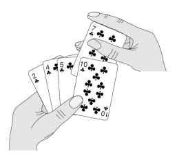

## 插入排序(Insertion Sort) ##
#### 1.基本思想 ####
在要排序的一组数中，假定前n-1个数已经排好序，现在将第n个数插到前面的有序数列中，使得这n个数也是排好顺序的。如此反复循环，直到全部排好顺序。算法适用于少量数据的排序，时间复杂度为O(n^2)，是稳定的排序方法。
#### 2.过程 ####


#### 3.平均时间复杂度 O(n²) ####
#### 4.Java代码实现 ####
```
public static void  insert_sort(int array[],int lenth){

   int temp;

   for(int i=0;i<lenth-1;i++){
       for(int j=i+1;j>0;j--){
           if(array[j] < array[j-1]){
               temp = array[j-1];
               array[j-1] = array[j];
               array[j] = temp;
           }else{         //不需要交换
               break;
           }
       }
   }
}
```
