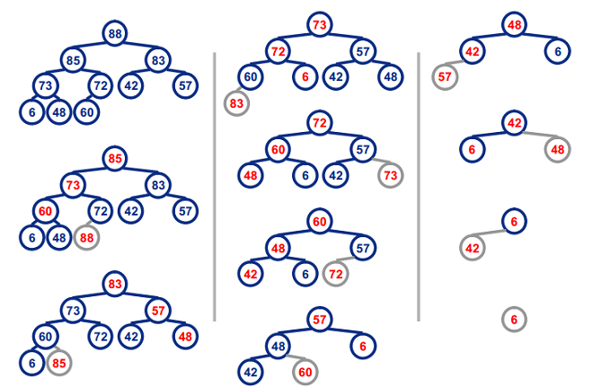

## 堆排序(Heap Sort) ##
#### 1.基本思想 ####

#### ①图示： （88,85,83,73,72,60,57,48,42,6） ####

#### 2.平均时间复杂度：O(n㏒n) ####
由于每次重新恢复堆的时间复杂度为O(n㏒n)，共n - 1次重新恢复堆操作，再加上前面建立堆时n / 2次向下调整，每次调整时间复杂度也为O(n㏒n)。二次操作时间相加还是O(n㏒n)。
#### 3.Java代码实现 ####
```
//构建最小堆
public static void MakeMinHeap(int a[], int n){
 for(int i=(n-1)/2 ; i>=0 ; i--){
     MinHeapFixdown(a,i,n);
 }
}
//从i节点开始调整,n为节点总数 从0开始计算 i节点的子节点为 2*i+1, 2*i+2  
public static void MinHeapFixdown(int a[],int i,int n){

   int j = 2*i+1; //子节点
   int temp = 0;

   while(j<n){
       //在左右子节点中寻找最小的
       if(j+1<n && a[j+1]<a[j]){   
           j++;
       }

       if(a[i] <= a[j])
           break;

       //较大节点下移
       temp = a[i];
       a[i] = a[j];
       a[j] = temp;

       i = j;
       j = 2*i+1;
   }
}
public static void MinHeap_Sort(int a[],int n){
  int temp = 0;
  MakeMinHeap(a,n);

  for(int i=n-1;i>0;i--){
      temp = a[0];
      a[0] = a[i];
      a[i] = temp;
      MinHeapFixdown(a,0,i);
  }     
}
```
