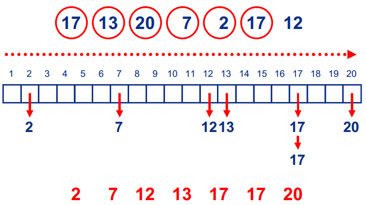
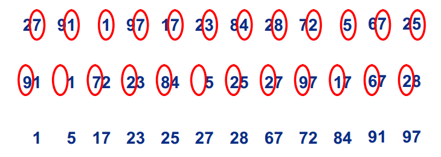

## 基数排序(Radix Sort或Bin Sort) ##
#### 1.基本思想 ####
BinSort想法非常简单，首先创建数组A[MaxValue]；然后将每个数放到相应的位置上（例如17放在下标17的数组位置）；最后遍历数组，即为排序后的结果。
#### 2.图示 ####

①**问题：**当序列中存在较大值时，BinSort 的排序方法会浪费大量的空间开销。  
②**思想：**基数排序是在BinSort的基础上，通过基数的限制来减少空间的开销。
#### 3.过程 ####


（1）首先确定基数为10，数组的长度也就是10.每个数34都会在这10个数中寻找自己的位置。  
（2）不同于BinSort会直接将数34放在数组的下标34处，基数排序是将34分开为3和4，第一轮排序根据最末位放在数组的下标4处，第二轮排序根据倒数第二位放在数组的下标3处，然后遍历数组即可。
#### 4.Java代码实现 ####
```
public static void RadixSort(int A[],int temp[],int n,int k,int r,int cnt[]){

   //A:原数组
   //temp:临时数组
   //n:序列的数字个数
   //k:最大的位数2
   //r:基数10
   //cnt:存储bin[i]的个数

   for(int i=0 , rtok=1; i<k ; i++ ,rtok = rtok*r){

       //初始化
       for(int j=0;j<r;j++){
           cnt[j] = 0;
       }
       //计算每个箱子的数字个数
       for(int j=0;j<n;j++){
           cnt[(A[j]/rtok)%r]++;
       }
       //cnt[j]的个数修改为前j个箱子一共有几个数字
       for(int j=1;j<r;j++){
           cnt[j] = cnt[j-1] + cnt[j];
       }
       for(int j = n-1;j>=0;j--){      //重点理解
           cnt[(A[j]/rtok)%r]--;
           temp[cnt[(A[j]/rtok)%r]] = A[j];
       }
       for(int j=0;j<n;j++){
           A[j] = temp[j];
       }
   }
}
```
