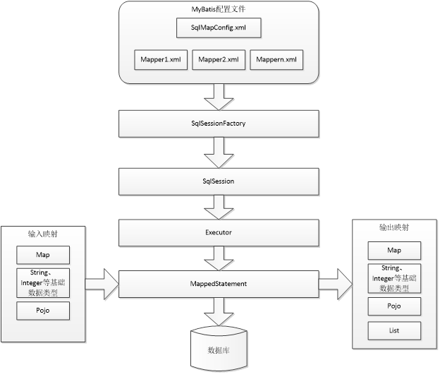

## MyBatis
**使用JDBC编程问题总结**  
**1.JDBC编程步骤**  
1. 加载数据库驱动
2. 创建并获取数据库链接
3. 创建jdbc statement对象
4. 设置sql语句
5. 设置sql语句中的参数(使用preparedStatement)
6. 通过statement执行sql并获取结果
7. 对sql执行结果进行解析处理
8. 释放资源(resultSet、preparedstatement、connection)

**2.JDBC问题总结**  
1. 数据库连接创建、释放频繁造成系统资源浪费，从而影响系统性能。如果使用数据库连接池可解决此问题。
2. Sql语句在代码中硬编码，造成代码不易维护，实际应用中sql变化的可能较大，sql变动需要改变java代码。
3. 使用preparedStatement向占有位符号传参数存在硬编码，因为sql语句的where条件不一定，可能多也可能少，修改sql还要修改代码，系统不易维护。
4. 对结果集解析存在硬编码（查询列名），sql变化导致解析代码变化，系统不易维护，如果能将数据库记录封装成pojo对象解析比较方便。  

### 1. MyBatis介绍
MyBatis 本是apache的一个开源项目iBatis, 2010年这个项目由apache software foundation 迁移到了google code，并且改名为MyBatis 。2013年11月迁移到Github。  
MyBatis是一个优秀的持久层框架，它对jdbc的操作数据库的过程进行封装，使开发者只需要关注 SQL 本身，而不需要花费精力去处理例如注册驱动、创建connection、创建statement、手动设置参数、结果集检索等jdbc繁杂的过程代码。  
Mybatis通过xml或注解的方式将要执行的各种statement（statement、preparedStatemnt、CallableStatement）配置起来，并通过java对象和statement中的sql进行映射生成最终执行的sql语句，最后由mybatis框架执行sql并将结果映射成java对象并返回。  
**MyBatis架构**

### 2. MyBatis配置
1. mybatis配置  
SqlMapConfig.xml，此文件作为mybatis的全局配置文件，配置了mybatis的运行环境等信息。
mapper.xml文件即sql映射文件，文件中配置了操作数据库的sql语句。此文件需要在SqlMapConfig.xml中加载。  
2. 通过mybatis环境等配置信息构造SqlSessionFactory即会话工厂
3. 由会话工厂创建sqlSession即会话，操作数据库需要通过sqlSession进行。
4. mybatis底层自定义了Executor执行器接口操作数据库，Executor接口有两个实现，一个是基本执行器、一个是缓存执行器。
5. Mapped Statement也是mybatis一个底层封装对象，它包装了mybatis配置信息及sql映射信息等。mapper.xml文件中一个sql对应一个Mapped Statement对象，sql的id即是Mapped statement的id。
6. Mapped Statement对sql执行输入参数进行定义，包括HashMap、基本类型、pojo，Executor通过Mapped Statement在执行sql前将输入的java对象映射至sql中，输入参数映射就是jdbc编程中对preparedStatement设置参数。
7. Mapped Statement对sql执行输出结果进行定义，包括HashMap、基本类型、pojo，Executor通过Mapped Statement在执行sql后将输出结果映射至java对象中，输出结果映射过程相当于jdbc编程中对结果的解析处理过程。

#### 从 XML 中构建 SqlSessionFactory
每个基于 MyBatis 的应用都是以一个 SqlSessionFactory 的实例为中心的。SqlSessionFactory 的实例可以通过 SqlSessionFactoryBuilder 获得。而 SqlSessionFactoryBuilder 则可以从 XML 配置文件或一个预先定制的 Configuration 的实例构建出 SqlSessionFactory 的实例。

从 XML 文件中构建 SqlSessionFactory 的实例非常简单，建议使用类路径下的资源文件进行配置。但是也可以使用任意的输入流(InputStream)实例，包括字符串形式的文件路径或者 file:// 的 URL 形式的文件路径来配置。MyBatis 包含一个名叫 Resources 的工具类，它包含一些实用方法，可使从 classpath 或其他位置加载资源文件更加容易。
```
String resource = "org/mybatis/example/mybatis-config.xml";
InputStream inputStream = Resources.getResourceAsStream(resource);
SqlSessionFactory sqlSessionFactory = new SqlSessionFactoryBuilder().build(inputStream);
```
XML 配置文件（configuration XML）中包含了对 MyBatis 系统的核心设置，包含获取数据库连接实例的数据源（DataSource）和决定事务作用域和控制方式的事务管理器（TransactionManager）。这里先给出一个简单的示例：  
```
<?xml version="1.0" encoding="UTF-8" ?>
<!DOCTYPE configuration
  PUBLIC "-//mybatis.org//DTD Config 3.0//EN"
  "http://mybatis.org/dtd/mybatis-3-config.dtd">
<configuration>
  <environments default="development">
    <environment id="development">
      <transactionManager type="JDBC"/>
      <dataSource type="POOLED">
        <property name="driver" value="${driver}"/>
        <property name="url" value="${url}"/>
        <property name="username" value="${username}"/>
        <property name="password" value="${password}"/>
      </dataSource>
    </environment>
  </environments>
  <mappers>
    <mapper resource="org/mybatis/example/BlogMapper.xml"/>
  </mappers>
</configuration>
```

当然，还有很多可以在XML 文件中进行配置，上面的示例指出的则是最关键的部分。要注意 XML 头部的声明，用来验证 XML 文档正确性。environment 元素体中包含了事务管理和连接池的配置。mappers 元素则是包含一组 mapper 映射器（这些 mapper 的 XML 文件包含了 SQL 代码和映射定义信息）。

### 3. Mapper XML 文件
MyBatis 的真正强大在于它的映射语句，也是它的魔力所在。由于它的异常强大，映射器的 XML 文件就显得相对简单。如果拿它跟具有相同功能的 JDBC 代码进行对比，你会立即发现省掉了将近 95% 的代码。MyBatis 就是针对 SQL 构建的，并且比普通的方法做的更好。

SQL 映射文件有很少的几个顶级元素（按照它们应该被定义的顺序）：

- `cache` – 给定命名空间的缓存配置。
- `cache-ref` – 其他命名空间缓存配置的引用。
- `resultMap` – 是最复杂也是最强大的元素，用来描述如何从数据库结果集中来加载对象。
- `parameterMap` – 已废弃！老式风格的参数映射。内联参数是首选,这个元素可能在将来被移除，这里不会记录。
- `sql` – 可被其他语句引用的可重用语句块。
- `insert` – 映射插入语句
- `update` – 映射更新语句
- `delete` – 映射删除语句
- `select` – 映射查询语句

#### select
查询语句是 MyBatis 中最常用的元素之一，光能把数据存到数据库中价值并不大，如果还能重新取出来才有用，多数应用也都是查询比修改要频繁。对每个插入、更新或删除操作，通常对应多个查询操作。这是 MyBatis 的基本原则之一，也是将焦点和努力放到查询和结果映射的原因。简单查询的 select 元素是非常简单的。比如：

	<select id="selectPerson" parameterType="int" resultType="hashmap">
	  SELECT * FROM PERSON WHERE ID = #{id}
	</select>
这个语句被称作 selectPerson，接受一个 int（或 Integer）类型的参数，并返回一个 HashMap 类型的对象，其中的键是列名，值便是结果行中的对应值。

注意参数符号：

`#{id}`
这就告诉 MyBatis 创建一个预处理语句参数，通过 JDBC，这样的一个参数在 SQL 中会由一个“?”来标识，并被传递到一个新的预处理语句中，就像这样：
```
// Similar JDBC code, NOT MyBatis…
String selectPerson = "SELECT * FROM PERSON WHERE ID=?";
PreparedStatement ps = conn.prepareStatement(selectPerson);
ps.setInt(1,id);
```


下面就是 insert，update 和 delete 语句的示例：

	<insert id="insertAuthor">
	  insert into Author (id,username,password,email,bio)
	  values (#{id},#{username},#{password},#{email},#{bio})
	</insert>

	<update id="updateAuthor">
	  update Author set
	    username = #{username},
	    password = #{password},
	    email = #{email},
	    bio = #{bio}
	  where id = #{id}
	</update>

	<delete id="deleteAuthor">
	  delete from Author where id = #{id}
	</delete>
如前所述，插入语句的配置规则更加丰富，在插入语句里面有一些额外的属性和子元素用来处理主键的生成，而且有多种生成方式。

首先，如果你的数据库支持自动生成主键的字段（比如 MySQL 和 SQL Server），那么你可以设置 useGeneratedKeys=”true”，然后再把 keyProperty 设置到目标属性上就OK了。例如，如果上面的 Author 表已经对 id 使用了自动生成的列类型，那么语句可以修改为:

	<insert id="insertAuthor" useGeneratedKeys="true"
	    keyProperty="id">
	  insert into Author (username,password,email,bio)
	  values (#{username},#{password},#{email},#{bio})
	</insert>
如果你的数据库还支持多行插入, 你也可以传入一个Authors数组或集合，并返回自动生成的主键。

	<insert id="insertAuthor" useGeneratedKeys="true"
	    keyProperty="id">
	  insert into Author (username, password, email, bio) values
	  <foreach item="item" collection="list" separator=",">
	    (#{item.username}, #{item.password}, #{item.email}, #{item.bio})
	  </foreach>
	</insert>

#### 动态 SQL
MyBatis 的强大特性之一便是它的动态 SQL。如果你有使用 JDBC 或其它类似框架的经验，你就能体会到根据不同条件拼接 SQL 语句的痛苦。例如拼接时要确保不能忘记添加必要的空格，还要注意去掉列表最后一个列名的逗号。利用动态 SQL 这一特性可以彻底摆脱这种痛苦。


虽然在以前使用动态 SQL 并非一件易事，但正是 MyBatis 提供了可以被用在任意 SQL 映射语句中的强大的动态 SQL 语言得以改进这种情形。


动态 SQL 元素和 JSTL 或基于类似 XML 的文本处理器相似。在 MyBatis 之前的版本中，有很多元素需要花时间了解。MyBatis 3 大大精简了元素种类，现在只需学习原来一半的元素便可。MyBatis 采用功能强大的基于 OGNL 的表达式来淘汰其它大部分元素。

- if
- choose (when, otherwise)
- trim (where, set)
- foreach
**if**

动态 SQL 通常要做的事情是根据条件包含 where 子句的一部分。比如：

	<select id="findActiveBlogWithTitleLike"
	     resultType="Blog">
	  SELECT * FROM BLOG
	  WHERE state = ‘ACTIVE’
	  <if test="title != null">
	    AND title like #{title}
	  </if>
	</select>

这条语句提供了一种可选的查找文本功能。如果没有传入“title”，那么所有处于“ACTIVE”状态的BLOG都会返回；反之若传入了“title”，那么就会对“title”一列进行模糊查找并返回 BLOG 结果（细心的读者可能会发现，“title”参数值是可以包含一些掩码或通配符的）。


如果希望通过“title”和“author”两个参数进行可选搜索该怎么办呢？首先，改变语句的名称让它更具实际意义；然后只要加入另一个条件即可。

	<select id="findActiveBlogLike"
	     resultType="Blog">
	  SELECT * FROM BLOG WHERE state = ‘ACTIVE’
	  <if test="title != null">
	    AND title like #{title}
	  </if>
	  <if test="author != null and author.name != null">
	    AND author_name like #{author.name}
	  </if>
	</select>

**choose, when, otherwise**  

有时我们不想应用到所有的条件语句，而只想从中择其一项。针对这种情况，MyBatis 提供了 choose 元素，它有点像 Java 中的 switch 语句。


还是上面的例子，但是这次变为提供了“title”就按“title”查找，提供了“author”就按“author”查找的情形，若两者都没有提供，就返回所有符合条件的 BLOG（实际情况可能是由管理员按一定策略选出 BLOG 列表，而不是返回大量无意义的随机结果）。

	<select id="findActiveBlogLike"
	     resultType="Blog">
	  SELECT * FROM BLOG WHERE state = ‘ACTIVE’
	  <choose>
	    <when test="title != null">
	      AND title like #{title}
	    </when>
	    <when test="author != null and author.name != null">
	      AND author_name like #{author.name}
	    </when>
	    <otherwise>
	      AND featured = 1
	    </otherwise>
	  </choose>
	</select>

**trim, where, set**

前面几个例子已经合宜地解决了一个臭名昭著的动态 SQL 问题。现在回到“if”示例，这次我们将“ACTIVE = 1”也设置成动态的条件，看看会发生什么。

	<select id="findActiveBlogLike"
	     resultType="Blog">
	  SELECT * FROM BLOG
	  WHERE
	  <if test="state != null">
	    state = #{state}
	  </if>
	  <if test="title != null">
	    AND title like #{title}
	  </if>
	  <if test="author != null and author.name != null">
	    AND author_name like #{author.name}
	  </if>
	</select>

如果这些条件没有一个能匹配上会发生什么？最终这条 SQL 会变成这样：

	SELECT * FROM BLOG
	WHERE

这会导致查询失败。如果仅仅第二个条件匹配又会怎样？这条 SQL 最终会是这样:

	SELECT * FROM BLOG
	WHERE
	AND title like ‘someTitle’

这个查询也会失败。这个问题不能简单地用条件句式来解决，如果你也曾经被迫这样写过，那么你很可能从此以后都不会再写出这种语句了。


MyBatis 有一个简单的处理，这在 90% 的情况下都会有用。而在不能使用的地方，你可以自定义处理方式来令其正常工作。一处简单的修改就能达到目的：

	<select id="findActiveBlogLike"
	     resultType="Blog">
	  SELECT * FROM BLOG
	  <where>
	    <if test="state != null">
	         state = #{state}
	    </if>
	    <if test="title != null">
	        AND title like #{title}
	    </if>
	    <if test="author != null and author.name != null">
	        AND author_name like #{author.name}
	    </if>
	  </where>
	</select>

where 元素只会在至少有一个子元素的条件返回 SQL 子句的情况下才去插入“WHERE”子句。而且，若语句的开头为“AND”或“OR”，where 元素也会将它们去除。


如果 where 元素没有按正常套路出牌，我们可以通过自定义 trim 元素来定制 where 元素的功能。比如，和 where 元素等价的自定义 trim 元素为：

	<trim prefix="WHERE" prefixOverrides="AND |OR ">
	  ...
	</trim>

prefixOverrides 属性会忽略通过管道分隔的文本序列（注意此例中的空格也是必要的）。它的作用是移除所有指定在 prefixOverrides 属性中的内容，并且插入 prefix 属性中指定的内容。


类似的用于动态更新语句的解决方案叫做 set。set 元素可以用于动态包含需要更新的列，而舍去其它的。比如：

	<update id="updateAuthorIfNecessary">
	  update Author
	    <set>
	      <if test="username != null">username=#{username},</if>
	      <if test="password != null">password=#{password},</if>
	      <if test="email != null">email=#{email},</if>
	      <if test="bio != null">bio=#{bio}</if>
	    </set>
	  where id=#{id}
	</update>

这里，set 元素会动态前置 SET 关键字，同时也会删掉无关的逗号，因为用了条件语句之后很可能就会在生成的 SQL 语句的后面留下这些逗号。（译者注：因为用的是“if”元素，若最后一个“if”没有匹配上而前面的匹配上，SQL 语句的最后就会有一个逗号遗留）


若你对 set 元素等价的自定义 trim 元素的代码感兴趣，那这就是它的真面目：

	<trim prefix="SET" suffixOverrides=",">
	  ...
	</trim>

注意这里我们删去的是后缀值，同时添加了前缀值。

**foreach**  

动态 SQL 的另外一个常用的操作需求是对一个集合进行遍历，通常是在构建 IN 条件语句的时候。比如：

	<select id="selectPostIn" resultType="domain.blog.Post">
	  SELECT *
	  FROM POST P
	  WHERE ID in
	  <foreach item="item" index="index" collection="list"
	      open="(" separator="," close=")">
	        #{item}
	  </foreach>
	</select>

foreach 元素的功能非常强大，它允许你指定一个集合，声明可以在元素体内使用的集合项（item）和索引（index）变量。它也允许你指定开头与结尾的字符串以及在迭代结果之间放置分隔符。这个元素是很智能的，因此它不会偶然地附加多余的分隔符。


注意 你可以将任何可迭代对象（如 List、Set 等）、Map 对象或者数组对象传递给 foreach 作为集合参数。当使用可迭代对象或者数组时，index 是当前迭代的次数，item 的值是本次迭代获取的元素。当使用 Map 对象（或者 Map.Entry 对象的集合）时，index 是键，item 是值。


到此我们已经完成了涉及 XML 配置文件和 XML 映射文件的讨论。下一章将详细探讨 Java API，这样就能提高已创建的映射文件的利用效率。

**bind**  

bind 元素可以从 OGNL 表达式中创建一个变量并将其绑定到上下文。比如：

	<select id="selectBlogsLike" resultType="Blog">
	  <bind name="pattern" value="'%' + _parameter.getTitle() + '%'" />
	  SELECT * FROM BLOG
	  WHERE title LIKE #{pattern}
	</select>

### 4. 小结
#### (1) `#{}`和`${}`
`#{}`表示一个占位符号，通过`#{}`可以实现preparedStatement向占位符中设置值，自动进行java类型和jdbc类型转换。`#{}`可以有效防止sql注入。 `#{}`可以接收简单类型值或pojo属性值。 如果parameterType传输单个简单类型值，`#{}`括号中可以是value或其它名称。

`${}`表示拼接sql串，通过`${}`可以将parameterType 传入的内容拼接在sql中且不进行jdbc类型转换， `${}`可以接收简单类型值或pojo属性值，如果parameterType传输单个简单类型值，`${}`括号中只能是value。


#### (2) parameterType和resultType
parameterType：指定输入参数类型，mybatis通过ognl从输入对象中获取参数值拼接在sql中。

resultType：指定输出结果类型，mybatis将sql查询结果的一行记录数据映射为resultType指定类型的对象。如果有多条数据，则分别进行映射，并把对象放到容器List中

#### (3) selectOne和selectList
selectOne查询一条记录，如果使用selectOne查询多条记录则抛出异常。

selectList可以查询一条或多条记录。
