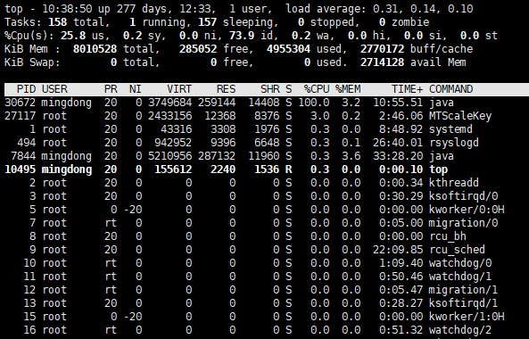

记一次线上服务器Java程序CPU 100%排查问题与解决
## top命令
首先用top命令查看当前占用CPU高的进程(PID)  
```
[mingdong@VM_45_31_centos V2]$ top
```
小写键盘的情况下，`Shift+P`键按照CPU占用由高到低排序  
打开大写键盘的情况下，直接按`P`键  

> top命令

可以看到占用CPU最高的进程PID是30672
然后通过`top -Hp 30672`查看每个线程占用的CPU情况
```
[mingdong@VM_45_31_centos V2]$ top -Hp 30672
```
然后可以看到占用CPU最高的线程tid是30679  
得到tid之后再将tid转化为16进制`30679`转化为16进制就是`0x77d7`
用`jstack PID`查看java虚拟机的堆栈情况
```
[mingdong@VM_45_31_centos V2]$ jstack 30672
```
```
"Reference Handler" #2 daemon prio=10 os_prio=0 tid=0x00007fe9d8114000 nid=0x77d8 in Object.wait() [0x00007fe9df6a1000]
   java.lang.Thread.State: WAITING (on object monitor)
	at java.lang.Object.wait(Native Method)
	at java.lang.Object.wait(Object.java:502)
	at java.lang.ref.Reference.tryHandlePending(Reference.java:191)
	- locked <0x00000000fc0067d0> (a java.lang.ref.Reference$Lock)
	at java.lang.ref.Reference$ReferenceHandler.run(Reference.java:153)

"VM Thread" os_prio=0 tid=0x00007fe9d810a000 nid=0x77d7 runnable

"Gang worker#0 (Parallel GC Threads)" os_prio=0 tid=0x00007fe9d801a800 nid=0x77d2 runnable

"Gang worker#1 (Parallel GC Threads)" os_prio=0 tid=0x00007fe9d801c800 nid=0x77d3 runnable

"Gang worker#2 (Parallel GC Threads)" os_prio=0 tid=0x00007fe9d801e000 nid=0x77d4 runnable

"Gang worker#3 (Parallel GC Threads)" os_prio=0 tid=0x00007fe9d8020000 nid=0x77d5 runnable

"Concurrent Mark-Sweep GC Thread" os_prio=0 tid=0x00007fe9d8063000 nid=0x77d6 runnable

"VM Periodic Task Thread" os_prio=0 tid=0x00007fe9d8162000 nid=0x77e0 waiting on condition

JNI global references: 1281

```
可以看到nid=0x77d7是GC所在的线程
